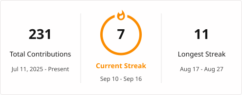

<h1 align="center">Hi 👋, I'm Bhargav Giri</h1>

<h3 align="center">
Computer Engineering Student | Android Developer | Java & Kotlin Enthusiast
</h3>

  

<h2 align="center">🏆 GitHub Trophies</h2>

  

- 🔭 I’m currently working on **Android applications using Kotlin and backend projects with Spring Boot.**

- 🌱 I’m currently learning **Advanced Android Development, Jetpack Compose, DSA, and System Design.**

- 👯 I’m looking to collaborate on **Android, Kotlin, Java, and Open Source projects.**

- 🤝 I’m looking for help with **Android architecture, Clean Architecture, and scalable backend development.**

- 👨‍💻 All of my projects are available at **[GitHub](https://github.com/bhargav7655)**

- 💬 Ask me about **Java, Kotlin, Android Studio, Spring Boot, SQL, Git, and REST APIs.**

- 📫 How to reach me **bhargavgiri10@gmail.com**

- ⚡ Fun fact **I enjoy turning ideas into real apps and constantly learning new technologies.**

<h3 align="left">Connect with me:</h3>

  

<h3 align="left">Languages and Tools:</h3>

  

  

  

  

  

  

  

  

  

  

  

<h2 align="center">📊 GitHub Statistics</h2>

  

  

<h2 align="center">🔥 GitHub Streak</h2>

  

<h2 align="center">🐍 My Contributions</h2>

  

